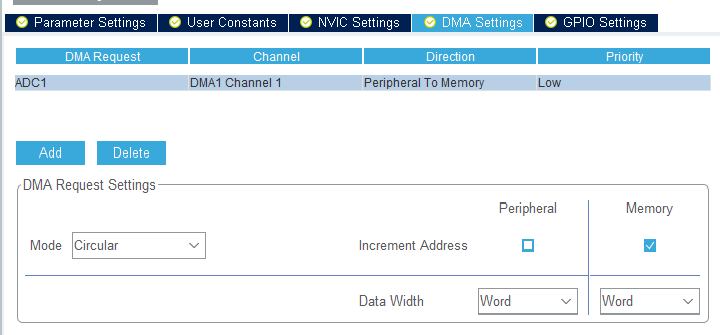

# Internal Temperature Sensor
Read internal temperature sensor by DMA

### How To
Before proceeding further, Let’s see How we have to get the value from the internal temperature sensor of the STM32. According to the reference manual (Pg- 236), The temp is given as follows


V25, Avg_Slope are given in the datasheet (Pg-79)


```
Also note that the ADC sampling time, while reading the temperature, needs to be 17.1 us.
```

### CubeMx Setup


Above is the clock section from the CubeMx. Note that I have selected the ADC clock as 14 MHz. The reason behind this is that the Temp sensor sampling time needs to be 17.1 us. While in the ADC setting, we have maximum sampling time as 239.5 cycles. So (239.5/14) gives us 17.1 us sampling time.


**Enable DMA**:



Above is the DMA setting for the ADC. Make sure that the DMA is circular and data width is selected as ‘Word‘. This is because the CubeMx uses ADC in 12 bits resolution by default and in order to store 12 bits we need the ‘Word‘ size.

**Reference**: [controllerstech.com](https://controllerstech.com/stm32-adc-multiple-channels-updated-method/)
